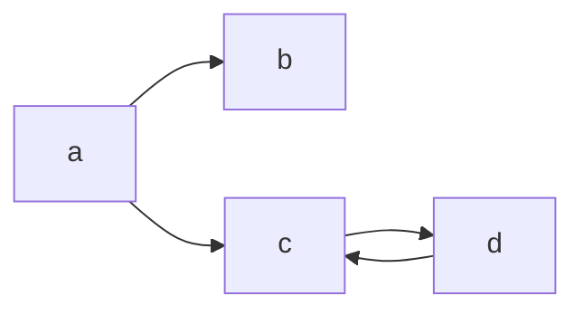
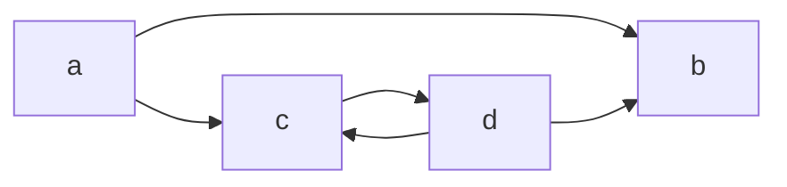

# Thuepaste

Some utilities for working with the Thue programming language.

The demo page is inspired by [this jsfiddle](https://jsfiddle.net/ao6egwh9/3/) and [Chris Pressey's Python implementation](https://github.com/catseye/Thue/blob/master/src/thue.py). I don't know who made that jsfiddle - all I know was that it was originally hosted at <http://z3.ca/~lament/thue.html> but that link is dead. (If you know who made it, please do tell me.)

Head over to <https://dragoncoder047.github.io/thuepaste/> to try it out.

The name is a pun on 'toothpaste'.

See [here](https://github.com/dragoncoder047/thuepaste/blob/main/examples.md) for descriptions of the example programs. See [here](https://github.com/dragoncoder047/thuepaste/blob/main/thue-api.md) for the internals of my Thue implementation.

## What is Thue?

Thue is an esoteric programming language invented by John Colagioia in early 2000. Thue is a random string rewriting system - you give it a set of rules, each composed of a 'left side' of what to look for and a 'right side' of what to replace it with if found (traditionally separated by `::=`), plus a string. On each step, Thue picks a random right side and replaces a random occurrence of it in the string with the corresponding left side. If no rules match, the program halts.

Traditionally Thue has also included two 'special' rules for input and output. For input, a right side of `:::` (three colons) will instead be replaced with a string of input from the user. For output, any right side starting with `~` (tilde) will be replaced with nothing, and everything after the tilde is printed instead.

I have also added a new type of rule, using regular expressions, signified by a separator of `::/=` instead of `::=`. The left side is a regular expression, and the right side is a replacement string (see [here](https://developer.mozilla.org/en-US/docs/Web/JavaScript/Reference/Global_Objects/String/replace#specifying_a_string_as_a_parameter) for how to use the capture groups). This does not affect the halting algorithm described below.

For all the nitty gritty about Thue, have a look at the [wikipedia article](https://en.wikipedia.org/wiki/Thue_(programming_language)) for the abstract mathematical Chomsky-heiarchy-whatever stuff, or [John Colagioia's manual](https://github.com/jcolag/Thue) for a lttle more on the syntax.

## Does it halt?

*I'm fully aware that the [halting problem](https://en.wikipedia.org/wiki/Halting_problem) is unsolvable. This is only an approximation to it.*

The algorithm I use starts by viewing a Thue program as a nondeterministic state machine that has a certain chance of halting from each state. Each 'state' is a particular sequence of characters in the string Thue is rewriting, and the arrows to the next states are each of the places a rule can be applied to rewrite the string.

Consider this Thue program:

```thue
a::=b
a::=c
c::=d
d::=c
::=
a
```

That translates directly into this state diagram:



From a starting state of `a`, it has a 50% chance of going into state `b`, and a 50% chance of going into state `c`. No rules match `b`, so it has a 100% chance of halting from `b`. And it can be readily seen that `c` and `d` form an infinite loop that has zero chance of halting. But how is that actually determined? The method I use keeps a history of what path from the root (in this case `a`) it has taken to get to some state. When it gets to `d` and considers the transition back to `c`, it sees that it has already passed through `c`, and from `c`, there is a 100% chance of transitioning to `d` (where it is), so it knows that an infinite loop has formed and returns 0% to the recursive calls that depend on `d`. So from `a`, it has two paths: one with a 100% chance of halting (to `b`) and one with a 0% chance of halting (to `c`). The result is the average of each of the choices, 50%. And indeed, this program halts only half the times it is run.

Now consider what happens when the rule `d::=b` is added to the above program. The state space now becomes this:



Now, there *is* a path out of the infinite loop. What is the chance of halting from state `d`? Each time around the loop, it has a 1/2 chance of halting (via `b`), and 1/2 chance of going around the loop again (via `c`). So the total chance of halting in this loop is 1/2 + 1/4 + 1/8 + 1/16 ... A little [numerical analysis](https://www.desmos.com/calculator/odzpdulihz) shows this series converges to 1. So our supposed infinite loop halts, and does so with certainty!

Now how does the computer determine this?

I DON'T KNOW. ***TODO***
