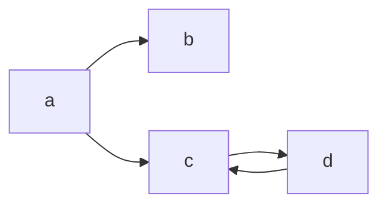
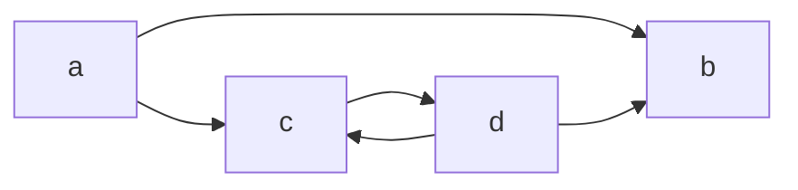

# Thuepaste

Some utilities for working with the Thue programming language.

The demo page is inspired by [this jsfiddle](https://jsfiddle.net/ao6egwh9/3/) and [Chris Pressey's Python implementation](https://github.com/catseye/Thue/blob/master/src/thue.py). I don't know who made that jsfiddle - all I know was that it was originally hosted at <http://z3.ca/~lament/thue.html> but that link is dead. (If you know who made it, please do tell me.)

Head over to <https://dragoncoder047.github.io/thuepaste/> to try it out.

The name is a pun on 'toothpaste'.

## What is Thue?

Thue is an esoteric programming language invented by John Colagioia in early 2000. Thue, in short, is a random string rewriting system - you give it a set of rules, each composed of a 'left side' of what to look for and a 'right side' of what to replace it with if found (traditionally separated by `::=`), plus a string. On each step, Thue picks a random right side and replaces a random occurrence of it in the string with the corresponding left side. If no rules match, the program halts.

Traditionally Thue has also included two 'special' rules for input and output. For input, a right side of `:::` (three colons) will not be replaced with that, but with a string of input from the user. For output, any right side starting with `~` (tilde) will instead be replaced with nothing, and everything after the tilde printed.

For all the nitty gritty, have a look at the [wikipedia article](https://en.wikipedia.org/wiki/Thue_(programming_language)) for the abstract mathematical Chomsky-heiarchy-whatever stuff, or [John Colagioia's manual](https://github.com/jcolag/Thue) for a lttle more on the syntax.

## The Examples

### samples/hello.t

The classic Hello World program. Starts with a single `@`, which immediately triggers the single rule, to print `Hello World!` and delete the `@`. The program then immediately halts.

### samples/truthmachine.t

A truth machine. It will prompt you for a string. Upon recieving `0`, it will print that and halt. Upon recieving `1`, it will print `11111111111111.....` forever.

### samples/sierpinski.t

One of the programs that came with the original Thue jsfiddle (linked above). Prints out a bit of Sierpinski trangle.

### samples/incany.t

This one from Chris Pressey will add one to any binary number that you provide as input and remove leading zeros.

### samples/nondeterministic.t

This one shows off the random part of Thue. It contains two rules that both have the same left side, so Thue has to randomly pick one to apply.

### samples/notmarkov.t

This one I found on the Wikipedia page shows the difference between Thue and another probablilistic algorithm, Markov chains. While a Markov chain given the same rules would correctly convert the asterisks into their number in Roman numerals (`XVIII`), Thue fails miserably here -- and produces abscurdities such as `IVXIIIV` or even `IXIX`.

### samples/tounary.t

This little one I wrote myself. Give it any number in decimal (of any number of digits) and it will convert it into that number of asterisks.

### samples/todecimal.t

This one, also by me, does the reverse of the previous sample. Given a string of asterisks, it will count them.

## How this Thue implementation works

Everything relevant to core Thue functionality is in `thue.js`.

The `Thue` class is the core manager for a Thue program. The constructor takes the list of rules and the string. You then repeatedly call `stepOnce()` on your Thue instance until it returns `true`, which means no rules match and the program has halted. However, the base `Thue` class doesn't handle input and output - the subclass `OutputThue` handles that. It takes an element along with the rules and text, and inserts a `<code>` (the workspace) in which it shows the current state of the string, and a `<pre>` (the output box), in which the output appears. `prompt()` is used for input. `OutputThue`'s `tick()` method wraps `stepOnce()` to keep the workspace element updated with the state.

The `parse` function covers the task of converting the raw text file into `Rule`s that can be passed to a `Thue`. It is passed the raw source code and a list of rule classes, and optionally a terminator to signal the end of the rules and the start of the beginning string (which defaults to a line containing `::=` and nothing else). For each of the lines, it passes them to each of the Rule classes passed in which do the work of parsing the rule into left and right, or throw an error if they can't parse it. If it throws, the next rule type is tried, until one matches. If none match, that's a syntax error, and that error is allowed to propagate up the Javascript call stack. A 2-tuple containing the list of the final Rule objects and then the starting string is returned. An error is also thrown if there are no rules.

The `Rule` class (and subclasses) implement two methods that the `Thue` class uses to apply them. First, `findMatches()` is passed the string, and must return a list of artifacts that each represent one match. Thue then picks one artifact at random, and passes it and the string to `applyMatch()`, which returns the new, modified string. The artifact format doesn't need to be anything standardized across rule types -- no artifact generated by class X will ever be passed to class Y. The artifacts just need to be something that will uniquely determine each match to the rule that matched, so it can be applied correctly.

The code in `main.js` does the aforementioned work of repeatedly calling `tick()` on the `OutputThue` instance to run the program, as well as fetching the examples and `parse()`.

## Does it halt?

*I'm fully aware that the [halting problem](https://en.wikipedia.org/wiki/Halting_problem) is unsolvable. This is only an approximation to it.*

The algorithm I use is based on the analogy that a Thue program is like a nondeterministic state machine that has a certain chance of halting from each state. Consider this Thue program:

```thue
a::=b
a::=c
c::=d
d::=c
::=
a
```

That translates directly into this state diagram:



From a starting state of `a`, it has a 50% chance of going into state `b`, and a 50% chance of going into state `c`. No rules match `b`, so it has a 100% chance of halting from `b`. And it can be readily seen that `c` and `d` form an infinite loop that has zero chance of halting. But how is that actually determined? The method I use keeps a history of what path from the root (in this case `a`) it has taken to get to some state. When it gets to `d` and considers the transition back to `c`, it sees that it has already passed through `c`, and from `c`, there is a 100% chance of transitioning to `d` (where it is), so it knows that an infinite loop has formed and returns 0% to the recursive calls that depend on `d`. So from `a`, it has two paths: one with a 100% chance of halting (to `b`) and one with a 0% chance of halting (to `c`). The result is the average of each of the choices, 50%. And indeed, this program halts only half the times it is run.

Now consider what happens when the rule `d::=b` is added to the above program. The state space now becomes this:



Now, there *is* a path out of the infinite loop. What is the chance of halting from state `d`? Each time around the loop, it has a 1/2 chance of halting (via `b`), and 1/2 chance of going around the loop again (via `c`). So the total chance of halting in this loop is 1/2 + 1/4 + 1/8 + 1/16 ... A little [numerical analysis](https://www.desmos.com/calculator/odzpdulihz) shows this series converges to 1. So our supposed infinite loop halts, and does so with certainty!

Now how does the computer determine this?

I DON'T KNOW. ***TODO***
