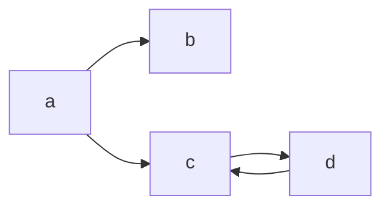
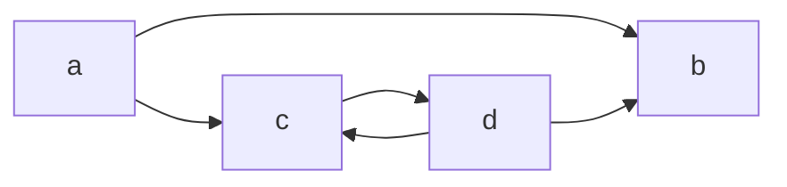
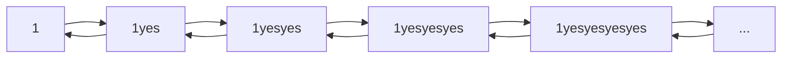
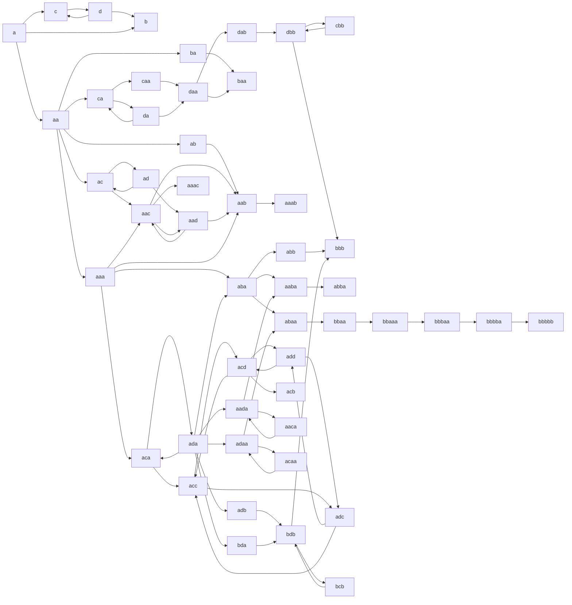

# Thuepaste

A function to determine the probability of a Thue program halting, plus some utilities for working with the Thue programming language.

The demo page is inspired by [this jsfiddle](https://jsfiddle.net/ao6egwh9/3/) and [Chris Pressey's Python implementation](https://github.com/catseye/Thue/blob/master/src/thue.py). I don't know who made that jsfiddle - all I know was that it was originally hosted at <http://z3.ca/~lament/thue.html> but that link is dead. (If you know who made it, please do tell me.)

Head over to <https://dragoncoder047.github.io/thuepaste/> to try it out.

The name is a pun on 'toothpaste'.

See [here](https://github.com/dragoncoder047/thuepaste/blob/main/examples.md) for descriptions of the example programs. See [here](https://github.com/dragoncoder047/thuepaste/blob/main/thue-api.md) for the internals of my Thue implementation.

## What is Thue?

Thue is an esoteric programming language invented by John Colagioia in early 2000. Thue is a random string rewriting system - you give it a set of rules, each composed of a 'left side' of what to look for and a 'right side' of what to replace it with if found (traditionally separated by `::=`), plus a string. On each step, Thue picks a random right side and replaces a random occurrence of it in the string with the corresponding left side. If no rules match, the program halts.

Traditionally Thue has also included two 'special' rules for input and output. For input, a right of `:::` (three colons) will instead be replaced with a string of input from the user (with the prompt implementation-dependednt - in my implementation it is everything after the `:::`, or 'input please' if there is nothing). For output, any right side starting with `~` (tilde) will be replaced with nothing, and everything after the tilde is printed instead.

I have also added a new type of rule, using regular expressions, signified by a separator of `::/=` instead of `::=`. The left side is a regular expression, and the right side is a replacement string (see [here](https://developer.mozilla.org/en-US/docs/Web/JavaScript/Reference/Global_Objects/String/replace#specifying_a_string_as_a_parameter) for how to use the capture groups). This does not affect the halting algorithm described below -- it is simply syntactic sugar to write many similar rules at once. For example, the rule needed to swap two digits is simply `(\d)(\d)::/=$2$1`, which would noramally require 90 (!) separate rules that begin with `01::=10`, `02::=20`, `12::=21`, and so on.

For all the nitty gritty about Thue, have a look at the [wikipedia article](https://en.wikipedia.org/wiki/Thue_(programming_language)) for the abstract mathematical Chomsky-heiarchy-whatever stuff, or [John Colagioia's manual](https://github.com/jcolag/Thue) for a lttle more on the syntax.

## Does it halt?

*I'm fully aware that the [halting problem](https://en.wikipedia.org/wiki/Halting_problem) is unsolvable. This is only an approximation to it.*

The algorthm I use has changed considerably since I frist concieved it, and it now constitutes three different 'passes' which are all different approaches. Strangely, I thought of the 'third pass' first, then the second, then the first!

### First Pass: Cycle Detection

This starts by viewing a Thue program as a nondeterministic state machine that has a certain chance of halting from each state. Each 'state' is a particular sequence of characters in the string Thue is rewriting, and the arrows to the next states are each of the places a rule can be applied to rewrite the string.

Consider this Thue program:

```thue
a::=b
a::=c
c::=d
d::=c
::=
a
```

That translates directly into this state diagram:



From a starting state of `a`, it has a 50% chance of going into state `b`, and a 50% chance of going into state `c`. No rules match `b`, so it has a 100% chance of halting from `b`. And it can be readily seen that `c` and `d` form an infinite loop that has zero chance of halting. But how is that actually determined? The `d::=c` rule applies to the output of the `c::=d` rule, and vice versa, and there is no way out of the loop, so the computer knows that if a `c` or `d` appear it will result in an infinite loop and will never halt. So from `a`, it has two paths: one with a 100% chance of halting (to `b`) and one with a 0% chance of halting (to `c`). The result is the average of each of the choices, 50%. And indeed, this program halts only half the times it is run.

Now consider what happens when the rule `d::=b` is added to the above program. The state space now becomes this:



Now, there *is* a path out of the infinite loop. What is the chance of halting from state `d`? Each time around the loop, it has a 1/2 chance of halting (via `b`), and 1/2 chance of going around the loop again (via `c`). So the total chance of halting in this loop is 1/2 + 1/4 + 1/8 + 1/16 ... A little [numerical analysis](https://www.desmos.com/calculator/odzpdulihz) shows this series converges to 1. So our supposed infinite loop halts, and does so with certainty!

Now how does the computer determine this? It looks for ways out of the loop - and since there is only one way out, it will always go that way. Boom.

### Second Pass: Self-Applicable Rules

The first edge case that has tripped me up is demonstrated by the simple truth machine program when given a `1` as input. It is given by this:

```thue
1::=1yes
yes::=~1
::=
1
```


This simple program has an infinite number of states (represented by the '...' in the state diagram above). The computer can't recurse infinitely, but it can see that the first rule applies to its own output. Due to that, applying that rule will not get anywhere closer to halting - so it will only apply it if nothing else matches (in the case of `1` and no `yes`).

### Third Pass: Brute Force Recursive

Another tripping point occurs when the self-applicable rule `a::=aa` is added to the second program above (the one that always halts). The state space now starts to look like this mess (and that's restricting it to three `a`s or less and omitting all the `...` transitions):



I didn't bother to draw any more once it got more than one screen tall!

Of course, because the c-d-c-d loop can halt, the entire program can still halt, but it can also still balloon out to infinity with the `a`s. But the computer needs to figure out that - this is where the self-applicable property of `a::=aa` comes into play here. Avoiding that rule results in finding the c-d-c-d-b loops faster and determining it is likely to halt, but still has a small chance that it will run infinitely.

Now what?

***TODO TODO TODO TODO TODO TODO TODO TODO TODO TODO TODO TODO TODO TODO TODO***
